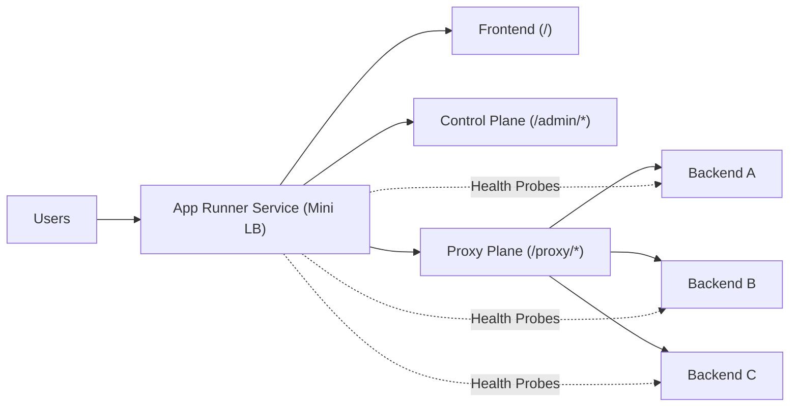

# Mini Load Balancer

Production-style Go project that demonstrates core distributed-systems signals:

- Traffic routing strategies: round robin, least connections, consistent hashing
- Reliability mechanics: active health checks + automatic failover + circuit breaker
- Bounded idempotent retries with backend failover
- Health-check hysteresis (`health_fail_threshold`, `health_success_threshold`) to avoid flapping
- Graceful draining for shutdown/redeploy
- Operational visibility: admin control-plane endpoints
- Request IDs, structured JSON logs, and Prometheus-style `/metrics`
- Recruiter-facing frontend: explains architecture and exposes live cluster state
- AWS deployment path: containerized and deployable to App Runner

## What Runs Where

- `GET /`:
  Recruiter-facing frontend with project narrative and live status dashboard.
- `GET /admin/backends`:
  Backend pool status (`alive`, `active_connections`) + active strategy.
- `GET/POST /admin/strategy`:
  Inspect/switch routing strategy.
- `GET /proxy/*`:
  Proxied traffic routed to backend pool via selected strategy.
- `GET /healthz`:
  Service health endpoint (used for deployment health checks).
- `GET /metrics`:
  Prometheus scrape endpoint (latency, error, retry, failover, backend-selection metrics).
- `GET /ai/status`:
  AI provider and configuration status.
- `POST /ai/analyze`:
  AI copilot endpoint for strategy/reliability guidance using live runtime snapshot.

## Local Run

```bash
go run . \
  -backends http://localhost:9001,http://localhost:9002,http://localhost:9003 \
  -strategy round_robin
```

Then open:

- `http://localhost:8080/`
- `http://localhost:8080/admin/backends`
- `http://localhost:8080/proxy/`

## Environment Variables

You can configure runtime via env vars (useful in AWS):

- `BACKENDS` (required if `-backends` not passed)
- `STRATEGY` (`round_robin`, `least_connections`, `consistent_hash`)
- `PROXY_PREFIX` (default `/proxy`)
- `HEALTH_PATH` (default `/health`)
- `ENABLE_FRONTEND` (`true`/`false`)
- `MODE` (`load_balancer` or `backend_demo`)
- `BACKEND_NAME` (used when `MODE=backend_demo`)
- `MAX_RETRIES` (default `2`, idempotent methods only)
- `RETRY_BACKOFF` (default `60ms`)
- `UPSTREAM_TIMEOUT` (default `10s`)
- `CIRCUIT_FAILURE_THRESHOLD` (default `3`)
- `CIRCUIT_OPEN_DURATION` (default `30s`)
- `HEALTH_FAIL_THRESHOLD` (default `2`)
- `HEALTH_SUCCESS_THRESHOLD` (default `2`)
- `DRAIN_DELAY` (default `5s`)
- `SHUTDOWN_TIMEOUT` (default `15s`)
- `AI_PROVIDER` (`heuristic`, `openai`, `auto`; default `heuristic`)
- `AI_TIMEOUT` (default `12s`)
- `AI_MODEL` (default `gpt-4o-mini`)
- `AI_OPENAI_API_KEY` (required for OpenAI mode)
- `AI_OPENAI_BASE_URL` (default `https://api.openai.com`)

## Deploy Full AWS-Owned Stack (Recommended)

This deploys:

- `mini-load-balancer-backend-a` (your AWS backend service)
- `mini-load-balancer-backend-b` (your AWS backend service)
- `mini-load-balancer` (load balancer pointing to those two services)

Run:

```bash
AWS_REGION="us-east-1" \
LB_STRATEGY="least_connections" \
./scripts/deploy_owned_stack.sh
```

After deployment:

- homepage: `https://<mini-load-balancer-url>/`
- backends status: `https://<mini-load-balancer-url>/admin/backends`
- proxy demo: `https://<mini-load-balancer-url>/proxy/whoami`

## AWS Deployment (App Runner)

Prerequisites:

- AWS CLI authenticated (`aws sts get-caller-identity` works)
- Docker running locally
- Reachable backend URLs for `BACKENDS` (public endpoints or VPC-accessible design)

Run:

```bash
BACKENDS="http://backend-a.example.com,http://backend-b.example.com" \
AWS_REGION="us-east-1" \
./scripts/deploy_aws_apprunner.sh
```

Script actions:

1. Creates/uses an ECR repository.
2. Builds a Linux service binary.
3. Builds and pushes container image.
4. Creates/uses IAM role for App Runner ECR access.
5. Creates or updates App Runner service.
6. Waits for service to become `RUNNING`.
7. Prints public HTTPS URL for your recruiter-facing site + APIs.

## Custom Domain + HTTPS + Route 53

Use this after the load balancer is running:

```bash
AWS_REGION="us-east-1" \
LB_SERVICE_NAME="mini-load-balancer" \
DOMAIN_NAME="lb.yourdomain.com" \
./scripts/configure_custom_domain.sh
```

`DOMAIN_NAME` must be an existing valid domain/subdomain you control in DNS.

## CloudWatch + WAF Hardening

```bash
AWS_REGION="us-east-1" \
LB_SERVICE_NAME="mini-load-balancer" \
ALERT_EMAIL="you@example.com" \
./scripts/setup_monitoring_and_waf.sh
```

This sets up:

- CloudWatch dashboard (CPU, memory, request volume, error rates, p95 latency)
- CloudWatch alarms + SNS topic
- WAF Web ACL with managed rule groups + rate limiting

## Recruiter Demo Script

1. Open homepage and explain why each strategy exists.
2. Open live control-plane and switch strategies in real time.
3. Call out health checks/failover as reliability primitives.
4. Mention consistent hashing for sticky distribution and reduced reshuffling.
5. Show `/admin/backends` as operational observability evidence.

## Architecture



## Test

```bash
go test ./...
```
