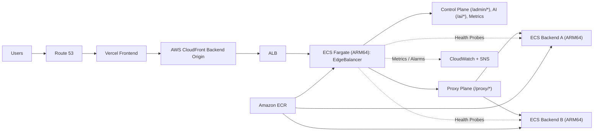

# EdgeBalancer

Production-style Go infrastructure project that demonstrates core distributed-systems signals:

- Traffic routing strategies: round robin, least connections, weighted routing, consistent hashing
- Reliability mechanics: active health checks, automatic failover, circuit breaker, retries, and graceful draining
- Health-check hysteresis to avoid backend flapping during recovery
- Recruiter-facing EdgeBalancer frontend with a live control plane and metrics dashboard
- Operational visibility through `/admin/*`, structured logs, and Prometheus-style `/metrics`
- AI copilot endpoint for runtime-aware routing and reliability guidance
- Current production stack: Vercel frontend -> AWS CloudFront -> ALB -> ECS/Fargate -> ECS backends

## Live Production Stack

Current public entrypoints:

- [https://miniloadbalancer.io](https://miniloadbalancer.io)
- [https://d1a0ru1gilc8jr.cloudfront.net](https://d1a0ru1gilc8jr.cloudfront.net)

Current frontend/backend split:

- Vercel serves the static EdgeBalancer UI from `web/`
- Vercel rewrites backend paths to `https://d1a0ru1gilc8jr.cloudfront.net`
- AWS continues to run the Go load balancer, control-plane endpoints, metrics, AI endpoint, and ECS backend services
- Route 53 keeps DNS ownership for `miniloadbalancer.io`

Current AWS layout:

- Route 53 hosted zone for `miniloadbalancer.io`
- CloudFront distribution `E1BF6B0VQTLRKS`
- ALB `mini-load-balancer-ecs-alb`
- ECS cluster `mini-load-balancer-fargate`
- ECS services:
  - `mini-load-balancer-ecs`
  - `mini-load-balancer-backend-a-ecs`
  - `mini-load-balancer-backend-b-ecs`

## What Runs Where

- `GET /`:
  EdgeBalancer frontend with project narrative, live backend state, and metrics dashboard.
- `GET /admin/backends`:
  Backend pool status (`alive`, `weight`, `active_connections`) and active strategy.
- `GET/POST /admin/strategy`:
  Inspect or switch routing strategy.
- `GET /admin/cost`:
  Estimated request, egress, and AI usage cost summary.
- `GET /admin/metrics-summary`:
  JSON dashboard summary for request volume, retries, failovers, upstream errors, circuit opens, backend selection, and latency averages.
- `GET /proxy/*`:
  Proxied traffic routed to ECS backend services through the selected strategy.
- `GET /healthz`:
  Service health endpoint used by ECS and external smoke checks.
- `GET /metrics`:
  Prometheus scrape endpoint for latency, error, retry, failover, and backend-selection metrics.
- `GET /ai/status`:
  AI provider and configuration status.
- `POST /ai/analyze`:
  AI copilot endpoint for routing and reliability guidance using live runtime state.

When `AUTH_MODE` is enabled, `/admin/*` and `/metrics` require `Authorization: Bearer <token>`.

## Local Run

```bash
go run . \
  -backends http://localhost:9001,http://localhost:9002,http://localhost:9003 \
  -backend-weights 1,2,3 \
  -strategy round_robin
```

Then open:

- `http://localhost:8080/`
- `http://localhost:8080/admin/backends`
- `http://localhost:8080/proxy/whoami`

## Environment Variables

You can configure runtime via environment variables:

- `BACKENDS` (required if `-backends` is not passed)
- `STRATEGY` (`round_robin`, `least_connections`, `weighted`, `consistent_hash`)
- `BACKEND_WEIGHTS` (comma-separated ints aligned to `BACKENDS`, each `>= 1`)
- `PROXY_PREFIX` (default `/proxy`)
- `HEALTH_PATH` (default `/health`)
- `ENABLE_FRONTEND` (`true` or `false`)
- `MODE` (`load_balancer` or `backend_demo`)
- `BACKEND_NAME` (used when `MODE=backend_demo`)
- `MAX_RETRIES` (default `2`, idempotent methods only)
- `RETRY_BACKOFF` (default `60ms`)
- `UPSTREAM_TIMEOUT` (default `10s`)
- `CIRCUIT_FAILURE_THRESHOLD` (default `3`)
- `CIRCUIT_OPEN_DURATION` (default `30s`)
- `HEALTH_FAIL_THRESHOLD` (default `2`)
- `HEALTH_SUCCESS_THRESHOLD` (default `2`)
- `DRAIN_DELAY` (default `5s`)
- `SHUTDOWN_TIMEOUT` (default `15s`)
- `AI_PROVIDER` (`heuristic`, `openai`, `auto`; default `heuristic`)
- `AI_TIMEOUT` (default `12s`)
- `AI_MODEL` (default `gpt-4o-mini`)
- `AI_OPENAI_API_KEY` (required for OpenAI mode)
- `AI_OPENAI_BASE_URL` (default `https://api.openai.com`)
- `AUTH_MODE` (`none`, `jwt_hs256`, `cognito_jwt`; default `none`)
- `AUTH_JWT_HMAC_SECRET` (required if `AUTH_MODE=jwt_hs256`)
- `AUTH_COGNITO_ISSUER` (required if `AUTH_MODE=cognito_jwt`)
- `AUTH_COGNITO_AUDIENCE` (optional, recommended)
- `RATE_LIMIT_ENABLED` (`true` or `false`; default `true`)
- `RATE_LIMIT_RPS` (default `20`)
- `RATE_LIMIT_BURST` (default `40`)
- `HIDE_UPSTREAM_HEADERS` (`true` or `false`; default `true`)
- `COST_AWARENESS_ENABLED` (`true` or `false`; default `true`)
- `COST_PER_MILLION_REQUESTS_USD` (default `0.20`)
- `COST_PER_GB_EGRESS_USD` (default `0.09`)
- `COST_AI_INPUT_PER_1K_TOKENS_USD` (default `0.00015`)
- `COST_AI_OUTPUT_PER_1K_TOKENS_USD` (default `0.00060`)

## Infrastructure as Code

A first-pass Terraform stack for the live AWS backend architecture is available under `infra/terraform`. It covers ECS/Fargate, the ALB, CloudFront, Route 53/ACM, CloudWatch/SNS, and ECR lifecycle policy.

## Vercel Frontend

The static frontend is deployed from `web/` to Vercel. `web/vercel.json` keeps the frontend static while proxying API paths to the AWS CloudFront backend:

- `/admin/*` -> AWS control-plane APIs
- `/ai/*` -> AWS AI copilot API
- `/proxy/*` -> AWS load-balancer data plane
- `/metrics` -> AWS Prometheus metrics
- `/healthz` -> AWS health check

Deploy manually:

```bash
cd web
npx --yes vercel@latest pull --yes --environment=production
npx --yes vercel@latest build --prod
npx --yes vercel@latest deploy --prebuilt --prod
```

## Current AWS Operations

Create or update the CloudFront front door in front of the ECS ALB:

```bash
AWS_PROFILE="<profile>" \
CUSTOM_DOMAIN="yourdomain.com" \
HOSTED_ZONE_ID="/hostedzone/XXXXXXXXXXXX" \
./scripts/create_ecs_cloudfront_frontdoor.sh
```

Provision CloudWatch dashboard, SNS-backed alarms, and ECS/ALB/CloudFront metrics for the live stack:

```bash
AWS_PROFILE="<profile>" \
ALERT_EMAIL="you@example.com" \
./scripts/setup_ecs_observability.sh
```

Apply an ECR lifecycle policy so old images do not accumulate indefinitely:

```bash
AWS_PROFILE="<profile>" \
./scripts/apply_ecr_lifecycle_policy.sh
```

Build and push a multi-architecture image manifest for both `linux/amd64` and `linux/arm64`:

```bash
AWS_PROFILE="<profile>" \
IMAGE_TAG="$(date +%Y%m%d%H%M%S)" \
./scripts/build_and_push_multiarch_image.sh
```

## Archived Migration Assets

Historical App Runner deployment and migration utilities are retained for reference only:

- `scripts/archive/README.md`
- `scripts/archive/apprunner/deploy_aws_apprunner.sh`
- `scripts/archive/apprunner/configure_custom_domain.sh`
- `scripts/archive/apprunner/deploy_owned_stack.sh`
- `scripts/archive/apprunner/setup_monitoring_and_waf.sh`
- `scripts/archive/migrations/migrate_apprunner_stack_to_ecs_express.sh`
- `scripts/archive/migrations/migrate_apprunner_stack_to_ecs_fargate.sh`
- `docs/archive/aws-support-ecs-express-mode-brief.md`

## Recruiter Demo Script

1. Open the EdgeBalancer homepage and explain the six infrastructure capabilities: health checks, round robin, least connections, circuit breakers, rate limiting, and metrics.
2. Show `/admin/backends` and `/admin/strategy` as the control plane.
3. Use the Metrics Dashboard to show live requests, retries, failovers, circuit opens, backend selection, and latency.
4. Show `/proxy/whoami` to prove live backend selection.
5. Show `/metrics` and the CloudWatch dashboard to demonstrate operational maturity beyond the browser UI.

## Architecture


```mermaid
flowchart LR
    U["Users"] --> R53["Route 53"]
    R53 --> V["Vercel Frontend"]
    V --> CF["AWS CloudFront Backend Origin"]
    CF --> ALB["ALB"]
    ALB --> LB["ECS Fargate (ARM64): EdgeBalancer"]
    LB --> CP["Control Plane (/admin/*), AI (/ai/*), Metrics"]
    LB --> PX["Proxy Plane (/proxy/*)"]
    PX --> B1["ECS Backend A (ARM64)"]
    PX --> B2["ECS Backend B (ARM64)"]
    LB -. "Health Probes" .-> B1
    LB -. "Health Probes" .-> B2
    LB -. "Metrics / Alarms" .-> CW["CloudWatch + SNS"]
    ECR["Amazon ECR"] --> LB
    ECR --> B1
    ECR --> B2
```

## Test

```bash
go test ./...
```
